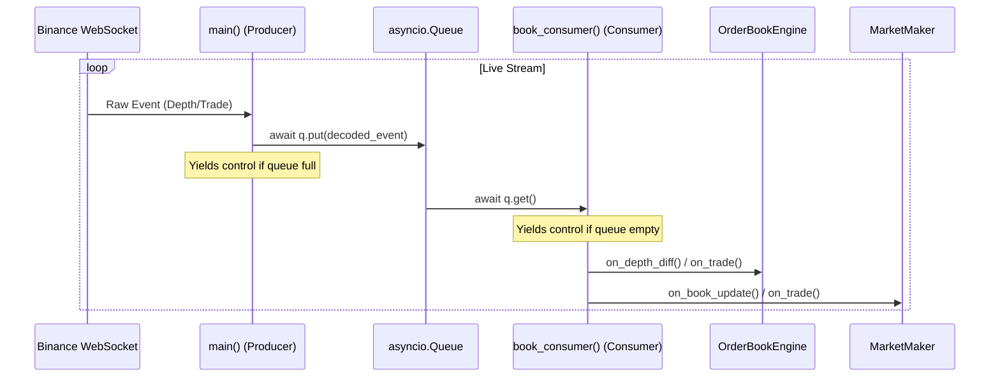

# Concurrency and Architecture Analysis

This document details how concurrency is handled in the Market Microstructure Simulator, explains the role of asynchronous I/O (`asyncio`), analyzes the design choice of omitting multithreading, and answers core questions regarding the project's purpose, impact, stack, tradeoffs, and pros/cons.

---

## 1. How `asyncio` is Used and How It Helped

This project is a **network-intensive, real-time data ingestion system** that consumes high-throughput feeds from the Binance WebSocket API. To handle this feed efficiently without blocking execution, the project uses Python's [asyncio](file:///Users/srijansarkar/Documents/Market%20Microstructure%20Simulator/backend/src/data_feed.py#L1) library in a single-threaded event loop.

### Concurrency Architecture (Producer-Consumer Pattern)
The main network loop in `data_feed.py` implements a classic **Asynchronous Producer-Consumer Pattern**:

1. **The Asynchronous Producer (`main()`):**
   * Establishes the WebSocket connection using `websockets.connect(...)` within an `async with` context manager.
   * Runs an infinite loop awaiting new messages via `await ws.recv()`. When there is no network packet, this call yields execution back to the `asyncio` event loop so other tasks can run.
   * Decodes incoming frames and pushes them to the queue: `await q.put(ev)`.

2. **The Asynchronous Queue (`asyncio.Queue`):**
   * Acts as a non-blocking FIFO buffer between the network ingestion and the business logic. It has a configured `maxsize=10000` to prevent memory blowup under extreme market conditions.

3. **The Asynchronous Consumer (`book_consumer()`):**
   * Spinned off as a concurrent task using `asyncio.create_task(...)`.
   * Awaits incoming decoded events via `await q.get()`. When the queue is empty, the consumer yields CPU control.
   * Applies updates to the [OrderBookEngine](file:///Users/srijansarkar/Documents/Market%20Microstructure%20Simulator/backend/src/order_book_engine.py) and executes the [MarketMaker](file:///Users/srijansarkar/Documents/Market%20Microstructure%20Simulator/backend/src/market_maker.py) quoting brain.

### How `asyncio` Helped
* **High-Throughput I/O Handling:** Market data updates occur rapidly (hundreds of events per second). `asyncio` allows the program to sleep while waiting for network I/O or queues without wasting CPU cycles.
* **Low Resource Footprint:** Unlike thread pools which reserve megabytes of stack memory per thread, `asyncio` coroutines are lightweight Python objects, enabling high concurrency with virtually zero overhead.
* **Elimination of Race Conditions:** Because everything runs in a single-threaded loop, there is no risk of multiple threads writing to the order book dictionary simultaneously. This completely avoids the need for locks, semaphores, or complex synchronization primitives, resulting in simpler and more reliable code.

---

## 2. Multithreading: Was it Used?

### Is Multithreading Used in the Project?
**No, multithreading is not used in this project.** 

The entire simulation engine runs on a single OS thread using Python's standard `asyncio` event loop.

### Why Omitting Multithreading Helped
* **Avoided Python's GIL Constraints:** Python has a Global Interpreter Lock (GIL), meaning even if multiple threads are used, only one thread can execute Python bytecode at a time. Threads do not yield true parallel execution for CPU-bound tasks in Python.
* **No Synchronization Overhead:** In high-frequency trading, low latency is critical. Thread synchronization (using locks or mutexes to protect the order book dictionaries) introduces lock contention, context-switching overhead, and risks of deadlocks. Omitting threads kept the system lock-free.
* **Simplified Concurrency Logic:** Debugging race conditions or memory corruption across threads is notoriously difficult. Single-threaded async tasks ensure deterministic execution order for order book updates.

---

## 3. Project Questions & Answers

### Q1: Why did you build this project?
1. **Low-Latency Simulation:** To build an execution engine simulator that parses combined trade and depth streams, maintains an accurate tick-by-tick order book representation, and measures end-to-end network latency.
2. **Algorithm Validation (Paper Trading):** To construct a risk-controlled Market Making brain (`MarketMaker`) that quotes bids and asks based on real-time order book imbalances and manages average holding prices to hedge inventory skew safely.
3. **Volatility Forecasting:** To explore short-term machine learning models (XGBoost) for predicting forward-looking volatility using order book depth signals and trade volume frequencies.

### Q2: What real-world impact does it create?
* **Zero-Capital Testing Environment:** Allows quantitative researchers and traders to test order routing, pricing strategies, and risk-management heuristics on live exchange data feeds without risking capital.
* **Latency Profiling:** Measures the difference between the exchange's execution time (`ts_event_us`) and the local ingestion time (`ts_recv_us`). This helps identify bottlenecks in WebSockets, JSON serialization, and feed handling.
* **Microstructure Modeling Education:** Serves as a modular, lightweight blueprint for understanding how real-world High-Frequency Trading (HFT) handlers process Level 2/3 feeds and manage local state synchronization.

### Q3: Why this tech stack?
* **Python:** Highly preferred for machine learning (XGBoost, scikit-learn) and tabular data manipulation (pandas, numpy), facilitating rapid development and modeling of features.
* **`websockets` & `asyncio`:** Built-in libraries that provide high-performance, asynchronous networking capabilities suited for event-driven systems.
* **XGBoost:** An optimized gradient boosting framework that trains decision trees rapidly, handles multi-collinear tabular features, and performs well for financial forecasting.

---

## 4. Architectural Decisions and Tradeoffs

### Decision 1: Single-Threaded Asynchronous Loop vs. Multi-Process Architecture
* **Decision:** Keep network ingestion, order book syncing, and market maker logic on a single thread (`asyncio`).
* **Tradeoff:** Python's single thread is very fast for handling network packets, but CPU-bound tasks (like writing to CSV, logging to stdout, or running the XGBoost predictor) block the event loop. If logging or inference takes $50\text{ ms}$, the WebSocket receiver halts for $50\text{ ms}$, creating network buffering delays.

### Decision 2: Decoupled Producer-Consumer via Queue
* **Decision:** Feed parsed packets into an `asyncio.Queue` rather than processing them directly in the WebSocket receive loop.
* **Tradeoff:** This isolates the network socket from execution logic, preventing network buffer overflows if the order book calculations stall. However, if the consumer task is slower than the incoming feed, a queue lag builds up, meaning the market maker trades on stale prices.

### Decision 3: Event-Driven CSV Logging
* **Decision:** Log a row in `features.csv` for *every* WebSocket event received.
* **Tradeoff:** Captures granular order book imbalances and trades, but creates a highly irregular time series. During high volatility, thousands of rows are written in seconds (most showing no mid-price change), rendering standard rolling feature calculations useless.

---

## 5. Pros & Cons in Depth

### Pros
* **Resource Efficiency:** Low CPU and memory footprint. Running on a single thread allows the simulator to consume live feeds with minimal overhead.
* **Ease of Maintenance:** Lock-free, single-threaded structure means no deadlocks, race conditions, or complex thread synchronization bugs.
* **Reconstruction Accuracy:** The system correctly replicates Level 2 order book dynamics, handles snapshot gaps, and maintains bid/ask limits accurately.
* **Rich ML Ecosystem:** Leverages Python's powerful statistics and machine learning libraries directly (XGBoost, pandas, scikit-learn).

### Cons
* **GIL Limitations:** Under extreme volume, single-threaded execution cannot scale. If CPU-bound tasks (like printing logs, feature engineering, or computing indicators) take too long, they delay the event loop and cause latency spikes.
* **Queue Lag Risk:** Because processing is decoupled, there is no backpressure check. If the consumer falls behind the feed rate, the queue silently grows, leading to stale execution decisions.
* **File I/O Blocking:** Writing rows to `features.csv` on every packet is a synchronous, blocking file write operation. This stalls the entire event loop periodically.
* **Offline Model Isolation:** Training the XGBoost model is treated as a separate process. The simulator is not currently executing live predictions on the WebSocket thread in real time.
