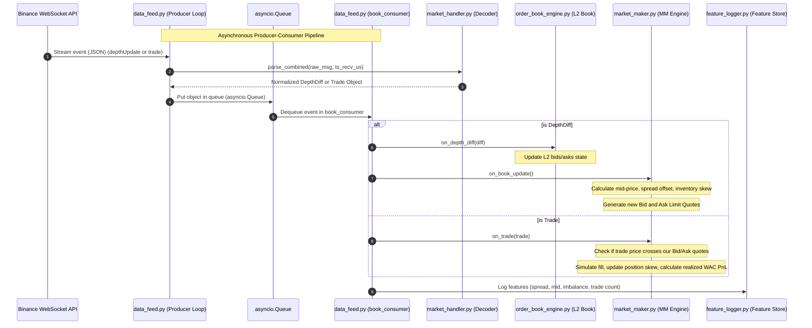

# Ultra-Low-Latency Market Microstructure Simulator & Execution Engine
### A Comprehensive Technical & Recruiter-Ready Guide

This guide breaks down the design, data pipelines, file responsibilities, and key algorithmic components of the **Ultra-Low-Latency Market Microstructure Simulator**. It is structured to help you master the codebase and articulate its value to a recruiter in a high-impact, professional manner.

---

## 1. High-Level Project Pitch (For Recruiters)
> [!NOTE]
> Use this 30-second elevator pitch when talking to quant finance, HFT, or backend engineering recruiters.

*"I built a **Real-Time Market Microstructure Simulator and Execution Engine** that models high-frequency market-making strategies on live cryptocurrency order books (specifically **BTCUSDT**). The system connects to the Binance exchange via a high-throughput **WebSocket multi-stream**, maintaining a local, memory-optimized **Level 2 (L2) order book** synchronized with the REST API. It uses an **asynchronous event-driven architecture** (via Python's `asyncio`) to ingest live trade prints and depth updates, compute real-time microstructural features (like order book imbalance and spread dynamics), and execute a **risk-managed market-making strategy** that implements inventory skewing and advanced realized PnL calculations for both long and short positions. It also logs high-frequency features to act as a feature store for a **Volatility Prediction Machine Learning model**."*

---

## 2. File-by-File Technical Breakdown
The project is structured with a modular, highly decoupled design pattern separating **Data Ingestion**, **Parsing/Decoding**, **State Management (Order Book Engine)**, **Algorithmic Quoting**, and **Feature Stores (ML Pipeline)**.

```
backend/src/
├── data_feed.py                     # Orchestrator & Event Loop Main Entry point
├── market_handler.py                # Stateless Decoder & Dataclasses
├── order_book_engine.py             # L2 Order Book State Manager (REST + WS Sync)
├── market_maker.py                  # Algorithmic Trading & Inventory Management Engine
└── volatility_prediction_ml/
    └── feature_logger.py            # High-Frequency Feature CSV Recorder
```

### 📄 1. [market_handler.py](file:///Users/srijansarkar/Documents/Market%20Microstructure%20Simulator/backend/src/market_handler.py)
* **What it is:** The stateless decoding layer of the application.
* **What it does:** 
  - Defines highly structured, lightweight typed containers (`DepthDiff` and `Trade` dataclasses) to avoid runtime overhead.
  - Parses raw JSON payloads streaming from Binance.
  - Normalizes timestamps, converting millisecond-level event times into microsecond-level timestamps (`ts_event_us` and `ts_recv_us`) to allow highly precise one-way latency tracking.
  - Distinguishes taker sides (aggressive buyers lifting the ask vs. aggressive sellers hitting the bid) using Binance's `"m"` (maker/taker) boolean flag.

### 📄 2. [order_book_engine.py](file:///Users/srijansarkar/Documents/Market%20Microstructure%20Simulator/backend/src/order_book_engine.py)
* **What it is:** The L2 local order book state manager.
* **What it does:** 
  - **The Cold Start Problem:** WebSocket feeds only broadcast *updates (diffs)*, not the full book. This engine handles this by buffering incoming WebSocket updates, fetching a complete REST snapshot of the order book (top 1000 levels), and applying the buffered updates in sequence to achieve synchronization.
  - **The Bridging Condition:** Loops through the buffered updates and applies the first diff that satisfies the bridging check:
    $$\text{Update First ID } (U) \le \text{Snapshot Last ID} + 1 \le \text{Update Last ID } (u)$$
  - **Memory Optimization:** Uses Python's standard dictionaries (`price -> quantity`) for fast $O(1)$ lookups and updates, and a double-ended queue (`collections.deque` with a max limit) for low-overhead buffering.
  - **Gap Detection & Robustness:** If a packet drops or network jitter occurs, it detects sequence gaps (i.e., when $\text{incoming } U > \text{last\_update\_id} + 1$). It triggers an automatic resynchronization flow (clearing the buffer and re-fetching the snapshot) to guarantee state integrity.

### 📄 3. [market_maker.py](file:///Users/srijansarkar/Documents/Market%20Microstructure%20Simulator/backend/src/market_maker.py)
* **What it is:** The algorithmic execution and risk management center.
* **What it does:** 
  - **Mid-Price & Spread Calculations:** Extracts the best bid and ask to compute the mid-price and spread.
  - **Inventory-Based Skewing:** Rather than quoting symmetrically around the mid-price, it uses a **linear inventory skew** to manage risk:
    $$\text{Skew} = \text{Inventory} \times \text{Inventory Skew Parameter}$$
    $$\text{Bid Price} = \text{Mid} - \text{Spread Offset} - \text{Skew}$$
    $$\text{Ask Price} = \text{Mid} + \text{Spread Offset} - \text{Skew}$$
    *If inventory is long ($>0$), the engine shifts quotes downward (bids lower to stop buying, asks lower to sell quickly). If inventory is short ($<0$), it shifts quotes upward (bids higher to buy back quickly, asks higher to stop selling).*
  - **Paper Trading Engine (Cross Detection):** Simulates order fills by evaluating real exchange trades. If a live transaction price crosses our quoted price, it registers a fill.
  - **Robust PnL Accounting:** Tracks realized PnL using **Weighted Average Cost (WAC)**. It correctly isolates long and short cycle PnL, tracking average open price (`avg_price`) dynamically as positions scale.

### 📄 4. [volatility_prediction_ml/feature_logger.py](file:///Users/srijansarkar/Documents/Market%20Microstructure%20Simulator/backend/src/volatility_prediction_ml/feature_logger.py)
* **What it is:** The high-frequency data logging and feature store manager.
* **What it does:** 
  - Opens and flushes a CSV output (`features.csv`) containing real-time feature records.
  - Writes microstructural features on every order book tick: `timestamp`, `mid`, `spread`, `spread_change`, `imbalance`, and `trade_count`.
  - Employs low-overhead `file.flush()` calls to ensure disk-writing does not create microsecond-level blocking gaps in our hot-path loop.

### 📄 5. [data_feed.py](file:///Users/srijansarkar/Documents/Market%20Microstructure%20Simulator/backend/src/data_feed.py)
* **What it is:** The main orchestrator connecting the components.
* **What it does:** 
  - Manages the main asynchronous event loop (`asyncio.run()`).
  - Sets up the WebSocket client listening to Binance combined streams (`btcusdt@depth@100ms` and `btcusdt@trade`).
  - Implements a **Producer-Consumer Design Pattern** using an asynchronous `asyncio.Queue` (with a capacity limit of 10,000 to prevent buffer bloat).
  - The **Producer** receives raw packets, measures ingest latency, parses them via `MarketDecoder`, and pushes them to the queue.
  - The **Consumer** (`book_consumer`) dequeues events, updates the L2 order book, triggers the market-maker quoting loop, evaluates simulated fills, and calculates the order book **Imbalance**:
    $$\text{Imbalance} = \frac{\text{Bid Volume} - \text{Ask Volume}}{\text{Bid Volume} + \text{Ask Volume}}$$
  - Feeds features to the `FeatureLogger` for offline ML training.

---

## 3. High-Frequency Microstructure Concepts
Recruiters in the quant trading space will look for specific domain concepts. Here is a breakdown of how they are implemented in this project:

| Concept | What It Means | Implementation in Project |
| :--- | :--- | :--- |
| **Order Book Imbalance** | The skew between buy volume and sell volume at the top levels of the book. It indicates immediate buying/selling pressure. | Computed in `data_feed.py` using `compute_imbalance(book, depth=5)`. It quantifies volume difference divided by total volume. |
| **Bid-Ask Spread** | The difference between the lowest ask price and the highest bid price. | Computed in `OrderBookEngine.spread()`. |
| **Inventory Skew** | A risk mitigation technique that skews quoting prices to incentivize trades that drive net inventory back to zero. | Implemented in `MarketMaker.on_book_update()`. Adjusts prices dynamically to prevent holding massive long/short risks. |
| **Gap Detection** | Verifying sequence numbers on streaming order book updates to ensure no packages were dropped. | Implemented in `OrderBookEngine.on_depth_diff()`. Compares incoming `U` against `last_update_id + 1`. |
| **Weighted Average Cost (WAC)** | Tracking the average entry price of a scaling position to ensure accurate realized PnL calculations. | Implemented in `MarketMaker.on_trade()`. Separates LONG and SHORT scaling calculations. |

---

## 4. End-to-End Data Flow
Below is the precise pipeline showing how a market event at Binance translates into a simulated trade and logged metric:



---

## 5. Talking Points for Interviews
Here are direct answers to common questions recruiters or hiring managers will ask you about this architecture:

### 1. "Why did you use Python instead of C++ for an ultra-low-latency simulator?"
* **Answer:** *"For production execution systems in HFT, C++ is indeed the gold standard. However, for a simulator, rapid prototyping and research flexibility are paramount. I used Python with `asyncio` to build an event-driven loop that behaves identically to high-performance single-threaded engines. By decoupling the decoder, state engine, and strategist, we can port this entire algorithm to C++ or Rust. Additionally, writing features directly to a CSV enables seamless integration with Python's scientific stack (Pandas, PyTorch) for training the volatility prediction ML models."*

### 2. "Explain the producer-consumer design pattern you used."
* **Answer:** *"I implemented a Producer-Consumer pattern utilizing an asynchronous bounded queue (`asyncio.Queue(maxsize=10000)`). The Producer coroutine runs the WebSocket client, decoding incoming bytes immediately and assigning localized ingress timestamps. It then hands the parsed objects off to the queue. The Consumer coroutine pulls from this queue to update the order book state and trigger the trading strategy. This ensures that slow disk I/O (CSV logging) or complex state calculations never block the socket ingestion loop, preventing buffer build-up on the TCP level."*

### 3. "How did you design the local L2 order book sync logic?"
* **Answer:** *"WebSockets only send incremental deltas, so we must bridge the state. When the engine starts, I buffer incoming WebSocket deltas in a queue. Simultaneously, I trigger an asynchronous REST request to Binance to grab a full order book snapshot. Once the snapshot is retrieved, I loop through my buffered deltas, discard those that are older than the snapshot, and find the 'bridge' delta where the update sequence `U <= snapshot_last_id + 1 <= u`. I apply this bridge and all subsequent deltas to achieve perfect synchronization, switching to live event updates thereafter."*

### 4. "How do you calculate realized PnL when scaling in and out of positions?"
* **Answer:** *"Calculating PnL by simply subtracting cash flows leads to huge accounting anomalies when holding inventory. Instead, I built a dynamic position tracker that maintains a weighted average cost (`avg_price`) for our open inventory. When we buy BTC to open a long position, we update the weighted average entry price. When we sell BTC, we realize PnL against that average price. Crucially, I implemented two-way logic: it handles both LONG positions (buying to open, selling to close) and SHORT positions (selling to open, buying to close) correctly, resetting average costs to zero when inventory is neutralized."*

---

## 6. Prompt to Generate Architecture Diagrams
You can copy and paste the prompt below into **Eraser.io**, **ChatGPT (with DALL-E/diagram plugin)**, or use the **Mermaid** code block below to generate high-fidelity diagrams for your presentation slides or GitHub portfolio.

### 📝 Prompt for Diagram Tools (Eraser.io / Draw.io / ChatGPT)
```text
Create a detailed, professional system architecture diagram for a Real-Time High-Frequency Quantitative Trading and Market Microstructure Simulator.

The diagram should illustrate:
1. Data Ingestion: An external Binance WebSocket server streaming real-time JSON payloads (L2 depth diffs and trade prints) at high frequencies.
2. Ingestion Pipeline: An Asynchronous main loop (data_feed.py) implementing a Producer-Consumer pattern.
   - The Producer receives JSON, attaches a local microsecond arrival timestamp, and passes it to a Stateless Decoder (market_handler.py) which yields typed dataclasses (DepthDiff and Trade).
   - These are pushed into a bounded Async Queue (asyncio.Queue, max size 10000).
3. State Management: The Consumer (book_consumer) dequeues elements.
   - DepthDiff objects are passed to the Order Book Engine (order_book_engine.py) to keep L2 bids and asks in sync. Highlight the initialization sync flow: buffering WS updates, pulling a REST snapshot from Binance API, applying the bridging condition (U <= lastUpdateId + 1 <= u), and triggering Gap Detection resync if updates drop.
4. Quoting & Strategy Layer: The Market Maker Engine (market_maker.py) reads the order book.
   - It computes the mid-price, spread, and Top-of-Book imbalances.
   - It applies a Risk Skewing calculation using active position inventory (Bid/Ask = Mid +/- Spread Offset - Skew) to prevent inventory blowups.
   - If a Trade event is dequeued, it runs a cross-detection logic (checking if trade price crosses our quotes) to simulate paper fills, updates position sizes, and calculates Weighted Average Cost (WAC) PnL for both long and short cycles.
5. Storage & ML Layer: On every book update, the main loop feeds state features to a Feature Logger (feature_logger.py) which writes high-frequency metrics (timestamps, mid, spread, imbalance, trade volumes) to features.csv for offline Machine Learning Volatility training.

Use a modern, premium color palette suitable for high-performance computing (sleek dark colors, clear nodes, distinct sequence numbers, clean boxes for file names, and arrow pathways for data flow).
```
