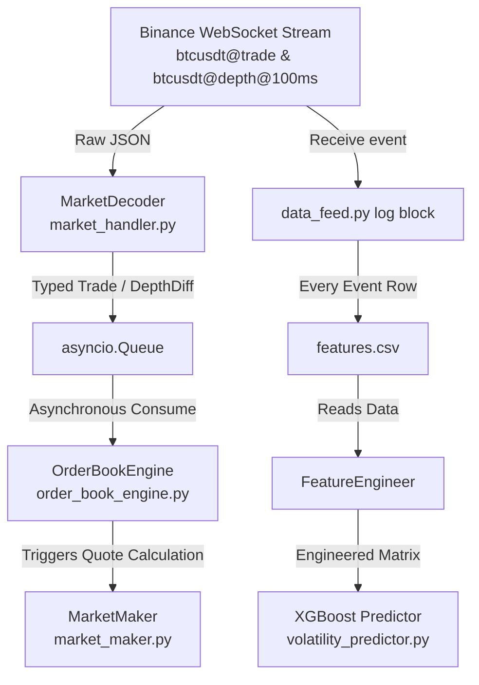

# Analysis of XGBoost Volatility Predictor

This document explains how the XGBoost-based volatility prediction model works within the Market Microstructure Simulator project, why the model's metrics are currently not yielding desired results (e.g., negative $R^2$, constant predictions, and $0$ feature importance), and provides concrete architectural recommendations to resolve these issues.

---

## 1. Project Component Map & Data Flow

To understand the XGBoost model, we must first look at the system's end-to-end data pipeline. The simulator is composed of five main components:



### Core Components
1. **WebSocket Data Ingestion ([data_feed.py](file:///Users/srijansarkar/Documents/Market%20Microstructure%20Simulator/backend/src/data_feed.py)):** Subscribes to combined Binance streams (trades and depth updates every 100ms) and processes packets asynchronously.
2. **Decoder ([market_handler.py](file:///Users/srijansarkar/Documents/Market%20Microstructure%20Simulator/backend/src/market_handler.py)):** Stateless component that decodes raw JSON frames into Python dataclasses: `Trade` (individual transaction data) and `DepthDiff` (order book updates).
3. **Order Book Engine ([order_book_engine.py](file:///Users/srijansarkar/Documents/Market%20Microstructure%20Simulator/backend/src/order_book_engine.py)):** Reconstructs the order book locally by merging REST snapshots with live WebSocket depth updates.
4. **Market Maker ([market_maker.py](file:///Users/srijansarkar/Documents/Market%20Microstructure%20Simulator/backend/src/market_maker.py)):** Runs a simulator representing active trading strategies that skew buy/sell orders relative to inventory limits and average prices.
5. **Feature Logger & Volatility Predictor ([volatility_predictor.py](file:///Users/srijansarkar/Documents/Market%20Microstructure%20Simulator/backend/src/volatility_prediction_ml/volatility_predictor.py)):** Logs current market state values into [features.csv](file:///Users/srijansarkar/Documents/Market%20Microstructure%20Simulator/backend/src/features.csv) and runs an offline XGBoost regression model to forecast future market volatility.

---

## 2. How the XGBoost Model Works in this Project

The model is trained as a **supervised regression model** designed to forecast future short-term volatility based on features of the order book and transaction activity.

### Feature Engineering Pipeline
The [FeatureEngineer](file:///Users/srijansarkar/Documents/Market%20Microstructure%20Simulator/backend/src/volatility_prediction_ml/volatility_predictor.py#L70) ingests the raw [features.csv](file:///Users/srijansarkar/Documents/Market%20Microstructure%20Simulator/backend/src/features.csv) and constructs **21 features** across three main categories:

| Category | Engineered Feature Names | Description |
| :--- | :--- | :--- |
| **Log Returns** | `return_1`, `return_5` | Log price changes over 1 and 5 rows. |
| **Lags** | `spread_lag[1/2/3]`, `imbalance_lag[1/2/3]`, `trade_count_lag[1/2/3]`, `spread_change_lag[1/2/3]` | Shifted historical values to capture autocorrelation. |
| **Rolling Stats** | `rolling_mean_{spread,imbalance,trade_count}_5`, `rolling_std_{spread,imbalance,trade_count}_5`, `realized_volatility_5` | Mean and standard deviation over a rolling window of 5 rows. |

### The Target Variable (`future_volatility`)
The target variable that XGBoost tries to predict is defined as:
```python
df["future_volatility"] = (
    df["return_1"]
    .shift(-1)
    .rolling(window=30, min_periods=30)
    .std()
    .shift(-29)
)
```
* **Objective:** Compute the standard deviation of return changes over the next 30 rows of data.

---

## 3. Why the Results Are Not Coming as Desired (Root Causes)

Evaluating the model reveals a negative $R^2$ score (worse than predicting the mean) and exactly `0.000000` feature importance across all inputs. Running a diagnostics pass on the training data reveals several critical flaws in the logging and model formulation:

### Diagnostic Statistics (Actual Dataset)
* **`return_1` Zero Rate:** **`98.99%`** of all consecutive rows have a log return of exactly `0.0`.
* **`future_volatility` Zero Rate:** **`71.05%`** of all training labels are exactly `0.0`.
* **`trade_count` Zero Rate:** **`94.39%`** of all logged rows record exactly `0` trades.

---

### Root Cause Analysis

#### A. Packet-Driven Logging frequency (Event-driven vs. Time-driven)
In [data_feed.py](file:///Users/srijansarkar/Documents/Market%20Microstructure%20Simulator/backend/src/data_feed.py#L67-L110), every WebSocket packet (trade or depth update) triggers a new row write in `features.csv`.
Because depth updates arrive continuously (every 100ms) and trades arrive in rapid microsecond bursts, rows are logged extremely close to each other. During these short intervals, the best bid, best ask, and mid price rarely change. Thus, `return_1` remains exactly zero $98.99\%$ of the time.

> [!WARNING]
> Because rows represent individual WebSocket events rather than fixed units of time, a rolling window of $30$ rows does not correspond to a physical time interval. It spans seconds during calm periods, but mere milliseconds during rapid trade bursts.

#### B. Flat Volatility Target causing XGBoost "Collapse"
Because 1-period returns are zero $98.99\%$ of the time, standard deviations computed over 30 rows (`future_volatility`) are flat-lined at `0.0` in $71.05\%$ of the dataset. For the remaining samples, the volatility is non-zero but extremely microscopic (mean = `0.000003`).

XGBoost is trained to minimize the Mean Squared Error (MSE). When faced with a target variable that is mostly zero, the mathematically optimal action for the tree booster (without overfitting) is to make **zero splits** and predict a flat constant (the target mean of `0.00000302`). This explains:
* Why **all feature importances are 0.000000**.
* Why the model predicted volatility is a constant `0.00000302` for all live inputs.
* Why the test set $R^2$ is negative (`-0.003370`).

#### C. Flawed `trade_count` Resetting Logic
In [data_feed.py](file:///Users/srijansarkar/Documents/Market%20Microstructure%20Simulator/backend/src/data_feed.py#L110), `trade_count["count"]` is reset to 0 on *every* WebSocket message loop.
Since depth update frames are mixed into the stream and arrive far more frequently than trades, they trigger the logging code and immediately reset the trade count counter to `0` before the asynchronous consumer task has processed incoming trades or before trades have chance to accumulate. This causes the logged trade count to be `0` in $94.39\%$ of the data, erasing the volatility-to-volume correlation.

#### D. Concurrency Log Mismatch
`data_feed.py` writes data to the log *before* the asynchronous queue consumer task (`book_consumer`) actually updates the local order book.
```python
await q.put(ev)             # Hands off event to queue
if book.synced:
    bb = book.best_bid()     # Reads order book state
    ...
    logger.log(...)          # Logs features to CSV
```
Since the consumer has not yet executed when the logger queries `book.best_bid()`, the features are logged with a lag, aligning old state features with the new message timestamp.

---

## 4. Recommended Fixes & Architecture Refactoring

To resolve the model issues and create a predictive, high-performing volatility estimator, we recommend restructuring the data ingestion and modeling pipeline:

### 1. Resample Data to Fixed-Interval Time-Bars (e.g., 1-second bars)
Instead of event-based logging, log variables at a consistent frequency (such as every 1 second). This can be achieved by running a background timer loop that reads the current synced state of the `OrderBookEngine` and aggregates volume.

* **Result:** Log returns will represent actual price changes over meaningful time scales, eliminating the $98.99\%$ zero-return artifacts.

```python
# Conceptual Timer Loop in data_feed.py
async def logging_loop(book, maker, trade_count, interval=1.0):
    last_spread = None
    while True:
        await asyncio.sleep(interval)
        if book.synced:
            # Query state and calculate mid, spread, imbalance...
            # Write exactly 1 row per second
            # Aggregate trade counts properly over the 1-second window
            ...
```

### 2. Physical Time-Based Volatility Target
Redefine `future_volatility` as the standard deviation of 1-second log returns over a fixed window (e.g., the next 30 seconds or 60 seconds). This will provide a dense, meaningful target variable that reflects actual market volatility regime shifts.

### 3. Synchronized State Logging
Ensure that the logger queries and writes data *after* the `OrderBookEngine` has processed the current event queue. By updating features inside the consumer loop (`book_consumer`) rather than the WebSocket receiver loop, features will stay perfectly aligned with the live book updates.
